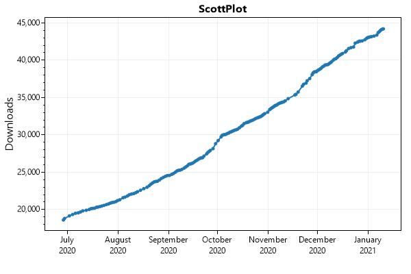

# NuGet Package Popularity Tracker

**This project uses Azure Functions to periodically record the total download count for certain NuGet packages.** 

Hourly download stats are recorded in tabular storage, and new plots are generated daily (with [ScottPlot](https://swharden.com/scottplot/)) and stored in web-accessible blob storage.

Unlike [NuGet Trends](https://nugettrends.com/packages?ids=ScottPlot&months=36) which only updates once per week, these download counts can be updated at any sample rate. 

## View Latest Plots

Plots are stored as static files in Azure Blob Storage:

**https://swhardendev.z13.web.core.windows.net** 
👈 _View latest plots_

